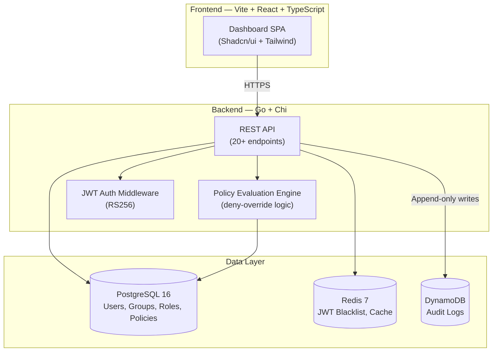
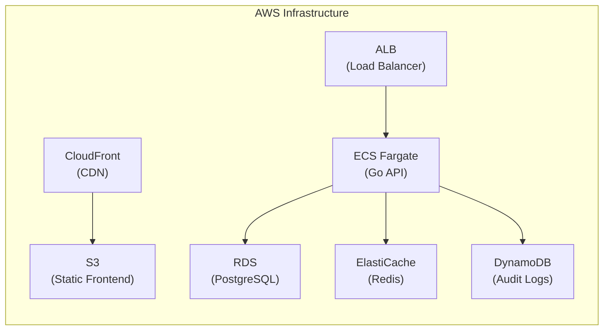

# 🛡️ Sentinel — IAM Dashboard & Policy Engine

A full-stack Identity and Access Management (IAM) system inspired by AWS IAM.
Sentinel implements a **Policy-Based Access Control (PBAC)** system with
role-based identity management, featuring a Go policy evaluation engine and a
beautiful React dashboard.

---

## What Is This?

Sentinel is a learning-oriented, production-architected IAM system that
replicates the core concepts of AWS IAM:

- **Users, Groups & Roles** — Identity management with flexible organizational
  structure
- **Policy Engine** — JSON policy documents evaluated with AWS-style
  deny-override logic
- **Policy Simulator** — Interactive tool to test "Can User X do Action Y on
  Resource Z?"
- **API Key Management** — Generate, scope, and revoke programmatic access keys
- **Audit Logging** — Complete trail of every access request and decision
- **Beautiful Dashboard** — Dark-mode React UI for managing everything visually

---

## Architecture



### AWS Deployment Target



---

## Tech Stack

| Layer          | Technology                   | Purpose                                      |
| -------------- | ---------------------------- | -------------------------------------------- |
| **Backend**    | Go 1.22+                     | High-performance API server                  |
| **Router**     | Chi                          | Lightweight, idiomatic HTTP routing          |
| **Frontend**   | Vite + React 18 + TypeScript | Fast SPA with hot reload                     |
| **UI**         | Shadcn/ui + Tailwind CSS     | Beautiful, accessible components             |
| **Primary DB** | PostgreSQL 16                | Relational data + JSONB for policy documents |
| **Cache**      | Redis 7                      | JWT blacklist, session cache, rate limiting  |
| **Audit**      | DynamoDB                     | High-throughput append-only audit logs       |
| **Auth**       | JWT (RS256)                  | Stateless authentication                     |
| **Containers** | Docker                       | Consistent dev/prod environments             |
| **IaC**        | Terraform                    | AWS infrastructure provisioning              |

---

## Core Concepts

### Policy-Based Access Control (PBAC)

Sentinel uses JSON policy documents — just like AWS IAM — to define permissions:

```json
{
  "Version": "2024-01-01",
  "Statement": [
    {
      "Effect": "Allow",
      "Action": ["users:List", "users:Get"],
      "Resource": "arn:sentinel:users/*"
    },
    {
      "Effect": "Deny",
      "Action": ["users:Delete"],
      "Resource": "arn:sentinel:users/*"
    }
  ]
}
```

### Deny-Override Evaluation

```
1. Default: DENY (nothing is allowed by default)
2. Gather all policies for the principal (direct + group + role)
3. Any explicit DENY? → DENY ❌ (always wins)
4. Any explicit ALLOW? → ALLOW ✅
5. Otherwise → implicit DENY ❌
```

### Identity Hierarchy

```
Users ─── belong to ───→ Groups
  │                         │
  └── can assume ──→ Roles  │
                      │     │
                      ▼     ▼
              Policies attached to any of these
```

---

## Project Structure

```
iam-sentinel/
├── backend/                    # Go API service
│   ├── cmd/server/             # Application entry point
│   └── internal/
│       ├── config/             # Environment configuration
│       ├── database/           # DB connections & migrations
│       ├── engine/             # Policy evaluation engine (core!)
│       ├── handlers/           # HTTP request handlers
│       ├── middleware/         # Auth, RBAC, logging, CORS
│       ├── models/             # Domain models
│       ├── repository/         # Data access layer
│       └── service/            # Business logic
├── frontend/                   # React SPA
│   └── src/
│       ├── components/         # Reusable UI components
│       ├── lib/                # API client, auth context
│       └── pages/              # Dashboard pages
├── deployments/                # Docker & Terraform
│   ├── docker/                 # Dockerfiles
│   └── terraform/              # AWS infrastructure as code
├── docker-compose.yml          # Local dev environment
├── Makefile                    # Dev commands
├── IMPLEMENTATION_PLAN.md      # Detailed build plan
└── VOCABULARY.md               # IAM terminology guide
```

---

## API Overview

| Domain        | Endpoints                                        | Description                          |
| ------------- | ------------------------------------------------ | ------------------------------------ |
| **Auth**      | `POST /auth/register, /login, /refresh, /logout` | User authentication & JWT management |
| **Users**     | `CRUD /users`, `POST /users/:id/policies`        | User management & policy attachment  |
| **Groups**    | `CRUD /groups`, `POST /groups/:id/users`         | Group management & membership        |
| **Roles**     | `CRUD /roles`, `POST /roles/:id/assume`          | Role management & assumption         |
| **Policies**  | `CRUD /policies`                                 | Policy document management           |
| **Simulator** | `POST /simulate`                                 | Interactive policy evaluation        |
| **API Keys**  | `GET/POST/DELETE /api-keys`                      | Programmatic access management       |
| **Audit**     | `GET /audit-logs`                                | Access request history               |

All endpoints are prefixed with `/api/v1/`.

---

## Getting Started

### Prerequisites

- Go 1.22+
- Node.js 20+
- Docker & Docker Compose
- Make

### Local Development

```bash
# Start infrastructure (PostgreSQL, Redis, DynamoDB Local)
docker-compose up -d

# Run database migrations
make migrate

# Start backend (hot reload)
make dev-backend

# Start frontend (hot reload)
make dev-frontend

# Or start everything at once
make dev
```

### Running Tests

```bash
# Backend tests
make test-backend

# Frontend tests
make test-frontend

# All tests
make test
```

---

## Documentation

| Document                                           | Description                                                             |
| -------------------------------------------------- | ----------------------------------------------------------------------- |
| [IMPLEMENTATION_PLAN.md](./IMPLEMENTATION_PLAN.md) | Detailed technical plan with phase-by-phase breakdown                   |
| [VOCABULARY.md](./VOCABULARY.md)                   | IAM terminology, access control models, and policy evaluation reference |

---

## License

MIT
